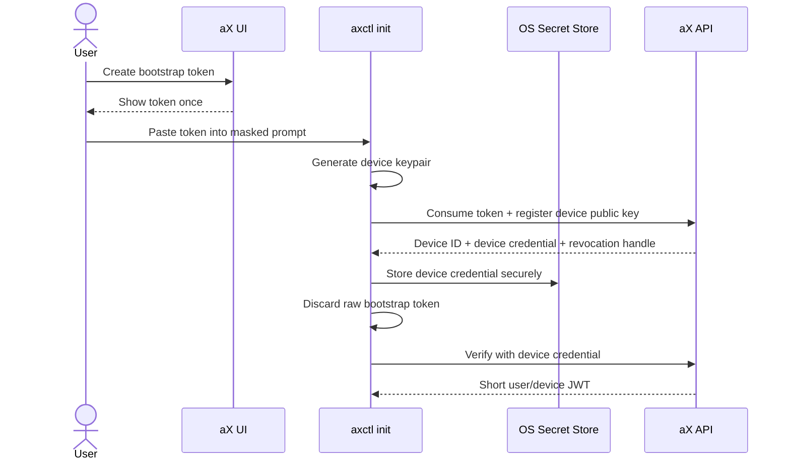

# AXCTL-BOOTSTRAP-001: Bootstrap and Secure Storage

**Status:** Draft  
**Owner:** @madtank / @ChatGPT  
**Date:** 2026-04-13  
**Related:** DEVICE-TRUST-001, AGENT-PAT-001, docs/agent-authentication.md, docs/credential-security.md

## Summary

Define the v1 bootstrap flow for `axctl init`.

The user starts with a user bootstrap token created in the aX UI. `axctl init`
uses that token once to enroll a local trusted device, then discards the raw
bootstrap token. After enrollment, normal CLI operation should use a
device-bound credential and agent-scoped PATs, not a reusable user token.

Critical rule:

> User bootstrap token material must never be readable by agents, plugins,
> background jobs, or future MCP servers.

## Terms

| Term | Meaning |
|------|---------|
| User bootstrap token | One-time or short-lived token shown once in the aX UI and pasted into `axctl init`. |
| Device credential | Long-lived local credential created during init and bound to a local device keypair. |
| Device keypair | Locally generated asymmetric keypair. Public key is registered with aX; private key remains local. |
| Agent PAT | Scoped token minted for one agent/audience and used only to exchange for short-lived JWTs. |
| Access JWT | Short-lived bearer token used for actual API calls. |

## Goals

- Make first-run setup boring and safe.
- Avoid placing user PATs in `.ax/config.toml`.
- Avoid making user PATs available to agents.
- Use OS secure storage in v1 instead of inventing a custom vault.
- Provide an upgrade path to hardware-backed keys later.
- Preserve API-first operation: the CLI calls documented backend endpoints.

## Non-Goals

- No custom encrypted vault in v1.
- No agent access to raw user bootstrap tokens.
- No browser-only requirement for CLI setup.
- No requirement for hardware attestation in v1.
- No replacement of existing agent PAT/JWT runtime behavior in this spec alone.

## Flow



## `axctl init` UX

`axctl init` should become the primary bootstrap entry point.

Minimum prompt flow:

1. Ask for aX environment URL.
2. Ask for workspace or space selection if not provided.
3. Prompt for bootstrap token using masked input.
4. Generate a local device keypair.
5. Show device fingerprint before final enrollment.
6. Register the device with the backend.
7. Store the device credential in OS secure storage.
8. Verify identity with `auth whoami`.
9. Offer to mint or configure an agent profile.

Example:

```text
axctl init

aX URL: https://next.paxai.app
Bootstrap token: ********
Device name: Jacob MacBook Pro

Device fingerprint:
SHA256: 4F2A 91C7 9B10 55E0

Authorize this device in aX? [Y/n]
✓ Device enrolled
✓ Credential stored in macOS Keychain
✓ Verified as madtank in madtank's Workspace
```

## Storage Contract

Preferred v1 storage:

- macOS: Keychain
- Windows: Credential Manager
- Linux desktop: Secret Service / libsecret

Fallbacks:

- Linux/headless without secret service may use a mode `0600` token file.
- Fallback must print a warning and include the path.
- Fallback should require explicit confirmation unless running in CI mode.

Prohibited:

- Raw bootstrap tokens in `.ax/config.toml`.
- Raw bootstrap tokens in global config.
- Raw bootstrap tokens in agent worktrees.
- Raw bootstrap tokens exposed through `profile env`.

## Local PIN

A local PIN may be added later as UX hardening, but it is not the trust anchor.

PIN rules:

- PIN may unlock local use of the device credential.
- PIN must not be treated as equivalent to device approval.
- PIN loss should not require account recovery if the user can revoke and
  re-enroll the device.

## API Contract Draft

### `POST /api/v1/auth/bootstrap/consume`

Consumes a user bootstrap token and registers a device.

Request:

```json
{
  "bootstrap_token": "axp_u_bootstrap_...",
  "device_public_key": "base64url...",
  "device_name": "Jacob MacBook Pro",
  "device_fingerprint": "sha256:...",
  "space_id": "optional-default-space",
  "client": {
    "name": "axctl",
    "version": "0.4.0",
    "platform": "darwin-arm64"
  }
}
```

Response:

```json
{
  "device_id": "dev_...",
  "device_credential": "opaque-refresh-or-wrapped-secret",
  "revocation_handle": "rvk_...",
  "user_id": "user-uuid",
  "default_space_id": "space-uuid"
}
```

Server behavior:

- Verify bootstrap token.
- Reject expired, revoked, or previously consumed one-time tokens.
- Store device public key and fingerprint.
- Emit audit event `device.enrolled`.
- Return a credential scoped to this device.

## Bootstrap Token Policy

Recommended v1:

- Bootstrap tokens are shown once.
- Bootstrap tokens have a short TTL, ideally minutes to hours.
- Bootstrap tokens can be explicitly revoked from Settings.
- Bootstrap tokens may be one-time use when practical.

If a longer-lived user PAT still exists for compatibility, `axctl init` should
classify it as a bootstrap credential and migrate the user toward device trust.

## Security Properties

Non-negotiable v1 properties:

- User bootstrap token shown once in UI.
- `axctl init` uses masked input.
- Bootstrap token is discarded after device enrollment.
- Agents cannot read bootstrap token material.
- Device credential is stored in OS secure storage when available.
- Device enrollment and credential use are audited.
- User can revoke the device independently from agent credentials.

## Acceptance Criteria

- `axctl init` can enroll a device from a bootstrap token.
- `axctl init` never writes the bootstrap token to `.ax/config.toml`.
- `axctl auth whoami` works after enrollment without re-pasting the bootstrap token.
- `axctl profile env` never prints a user bootstrap token.
- The backend records `device_id`, public key fingerprint, user id, and created time.
- The UI can show enrolled devices and revoke one device without revoking all agent PATs.
